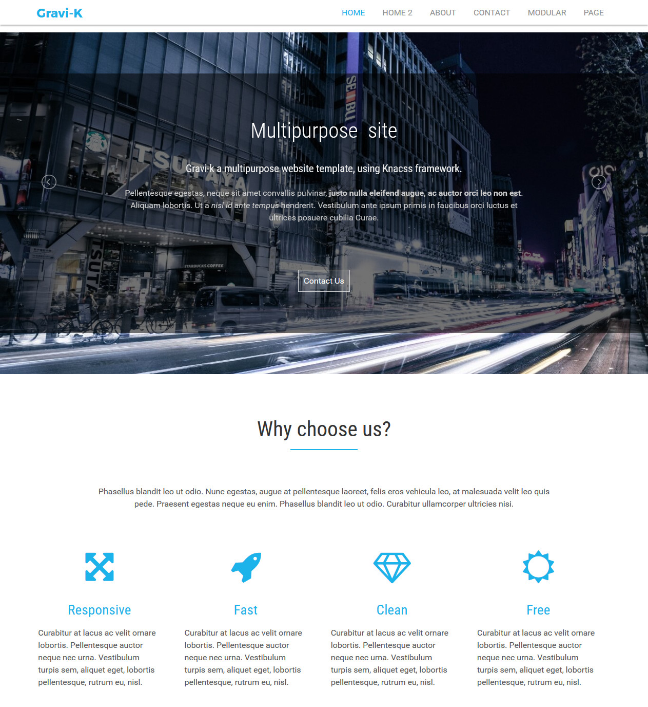

# Gravi-k



**Gravi-K** is a [Grav](http://getgrav.org) theme based on [Knascss](http://knacss.com/)
This is a base theme for starting your site, but also meant to be customized.

# Installation

Installing the Gravi-K theme can be done in one of two ways. Our GPM (Grav Package Manager) installation method enables you to quickly and easily install the theme with a simple terminal command, while the manual method enables you to do so via a zip file. 

The theme by itself is useful but require the admin plugin

## GPM Installation (Preferred)

The simplest way to install this theme is via the [Grav Package Manager (GPM)](http://learn.getgrav.org/advanced/grav-gpm) through your system's Terminal (also called the command line).  From the root of your Grav install type:

    bin/gpm install gravi-k

This will install the Gravi-k theme into your `/user/themes` directory within Grav. Its files can be found under `/your/site/grav/user/themes/gravi-k`.

## Manual Installation

To install this theme, just download the zip version of this repository and unzip it under `/your/site/grav/user/themes`. Then, rename the folder to `gravi-k`. You can find these files either on [GitHub](https://github.com/...) or via [GetGrav.org](http://getgrav.org/downloads/themes).

You should now have all the theme files under

    /your/site/grav/user/themes/gravi-k

>> NOTE: This theme is a modular component for Grav which requires the [Grav](http://github.com/getgrav/grav), [Error](https://github.com/getgrav/grav-theme-error) and [Problems](https://github.com/getgrav/grav-plugin-problems) plugins.

# Updating

As development for the Gravi-k theme continues, new versions may become available that add additional features and functionality, improve compatibility with newer Grav releases, and generally provide a better user experience. Updating Gravi-k is easy, and can be done through Grav's GPM system, as well as manually.

## GPM Update (Preferred)

The simplest way to update this theme is via the [Grav Package Manager (GPM)](http://learn.getgrav.org/advanced/grav-gpm). You can do this with this by navigating to the root directory of your Grav install using your system's Terminal (also called command line) and typing the following:

    bin/gpm update gravi-k

This command will check your Grav install to see if your Gravi-k theme is due for an update. If a newer release is found, you will be asked whether or not you wish to update. To continue, type `y` and hit enter. The theme will automatically update and clear Grav's cache.

## Manual Update

Manually updating Gravi-k is pretty simple. Here is what you will need to do to get this done:

* Delete the `your/site/user/themes/gravi-k` directory.
* Download the new version of the Gravi-k theme from either [GitHub](https://github.com/getgrav/grav-theme-gravi-k) or [GetGrav.org](http://getgrav.org/downloads/themes#extras).
* Unzip the zip file in `your/site/user/themes` and rename the resulting folder to `gravi-k`.
* Clear the Grav cache. The simplest way to do this is by going to the root Grav directory in terminal and typing `bin/grav clear-cache`.

> Note: Any changes you have made to any of the files listed under this directory will also be removed and replaced by the new set. Any files located elsewhere (for example a YAML settings file placed in `user/config/themes`) will remain intact.

## Features

* Fully responsive
* SCSS based CSS source files for easy customization
* Built-in support for on-page navigation
* Multiple page template types
* Fontawesome icon support

### Supported Page Templates

* Default view template

* Modular view templates:
  * Features Modular view template
  * Showcase Modular view template
  * Text Modular view template
  * Form Modular view template
  * Cards Modular view template
  * Tabs Modular view template
  * Google Map Modular view template
  * Testimonial Modular view template
  * Gallery Modular view template
  * Team Modular view template

* Blog view template (soon)

### Menu Features

#### Dropdown Menu

You can enable **dropdown menu** support by enabling it in the `gravi-k.yaml` configuration file. As per usual, copy this file to your `user/config/themes/` folder (create if required) and edit there.

```
dropdown:
  enabled: true
```

This will ensure that sub-pages show up as sub-menus in the navigation.

## Demo Contents

You can find inside theme directory the folder _demo where you can find the example contents for your site.

# Setup

If you want to set Gravi-k as the default theme, you can do so by following these steps:

* Navigate to `/your/site/grav/user/config`.
* Open the **system.yaml** file.
* Change the `theme:` setting to `theme: gravi-k`.
* Save your changes.
* Clear the Grav cache. The simplest way to do this is by going to the root Grav directory in Terminal and typing `bin/grav clear-cache`.

Once this is done, you should be able to see the new theme on the frontend. Keep in mind any customizations made to the previous theme will not be reflected as all of the theme and templating information is now being pulled from the **gravi-k** folder.
 